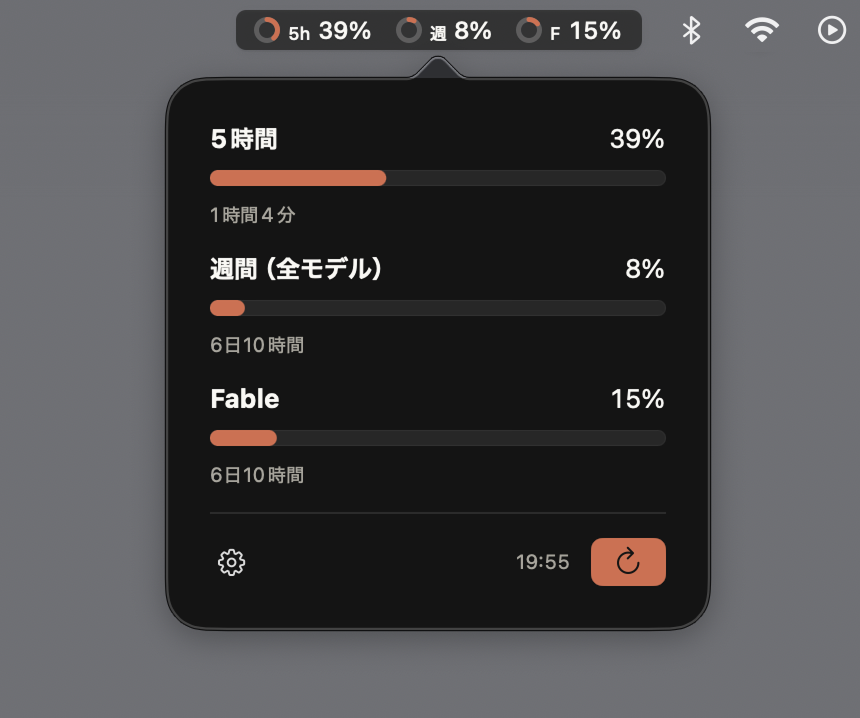

# Zanki（残機）

Claude Code のレート制限使用率（5時間 / 週間 など）を macOS のメニューバーに常時表示する常駐アプリです。ゲームの「残機」になぞらえて、あとどれだけ使えるかをひと目で確認できます。



- メニューバーに制限枠ごとの使用率をドーナツ＋数値で表示（60秒ごとに自動更新）。ラベルは `5h` = 5時間枠、`週` = 週間枠、モデル別の枠はモデル名の頭文字（例: `F` = Fable）
- クリックでポップオーバーを開き、各枠の使用率バーとリセットまでの残り時間を確認
- 使用率 60% 以上でドーナツ/バーが黄、80% 以上で赤に変化（数値の文字色は変わりません）
- 外観（ダーク / ライト）とアクセント（オレンジ / ホワイト）をギアメニューから切り替え可能
- 「ログイン時に Zanki を起動」のトグル付き

## 必要環境

- macOS 14 (Sonoma) 以上
- Swift 6.0 以上のツールチェーン（Xcode 16 相当の Command Line Tools のみで可・Xcode 本体は不要）
- [Claude Code](https://claude.com/claude-code) にログイン済みであること（`claude` コマンドでログインすると Keychain に認証情報が保存されます。Zanki はそれを利用します）

## インストール

配布バイナリはありません。各自の Mac でビルドしてください（数十秒で終わります）。

```bash
git clone <このリポジトリのURL>
cd zanki
./build.sh install   # ビルド → /Applications/Zanki.app へ配置して起動
```

初回起動時に Keychain アクセスの許可ダイアログが表示されるので「**常に許可**」を選んでください（「許可」だと 60 秒ごとの更新のたびにダイアログが再表示されることがあります）。

### 更新

```bash
git pull && ./build.sh install
```

### アンインストール

1. メニューバーの Zanki をクリック → ギアアイコン → 「終了」
2. `/Applications/Zanki.app` を削除
3. 「ログイン時に起動」を有効にしていた場合は、システム設定 > 一般 > ログイン項目 から Zanki を削除

## 仕組みとプライバシー

- Keychain に保存された Claude Code の認証トークンを使い、`api.anthropic.com/api/oauth/usage` を 60 秒ごとにポーリングします
- 通信先は `api.anthropic.com` のみです。トークンや使用率データを外部に送信したり、ディスクに保存したりすることはありません（トークンはメモリ内でのみ扱います）
- API が返した制限枠をそのまま表示するため、プランによる枠の増減に自動で追従します

## 注意事項

- 本アプリは非公式ツールであり、Anthropic とは無関係です
- 利用しているのは公開ドキュメントのない API のため、Anthropic 側の変更により予告なく動作しなくなる可能性があります
- 取得に失敗した場合は前回値を表示し続けます（一度も取得できていない場合は `--%`）
- 認証トークンは短命（1日程度）のため、その Mac で Claude Code をしばらく使っていないと「要ログイン」表示になります。ポップオーバーに表示される「ターミナルでログイン」ボタンを押すと `claude` が起動し、通常はそのままトークンが自動更新されます（更新できない場合は CLI がログイン手順を案内します）

## 開発

```bash
swift test
```

テストフレームワークは swift-testing（テストターゲット専用の外部依存）です。Xcode なしの Command Line Tools 環境には標準の Testing / XCTest が同梱されないための措置で、配布するアプリ本体には外部依存が一切含まれません。

## ライセンス

[MIT](LICENSE)
